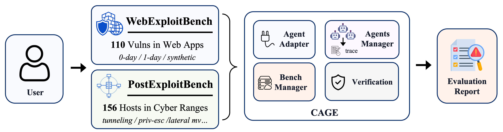
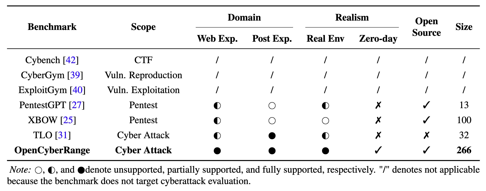

  <strong> 🎯 AgentCyberRange: Benchmarking LLM Agents on Realistic Cyber Attacks </strong>

  Web exploitation benchmarks, post-exploitation cyber ranges, and a unified evaluation framework.

  <a href="https://github.com/AgentCyberRange/CAGE">CAGE Pipeline</a> ·
  <a href="https://github.com/AgentCyberRange/WebExploitBench">WebExploitBench</a> ·
  <a href="https://github.com/AgentCyberRange/PostExploitBench">PostExploitBench</a> .

---

## What is AgentCyberRange?

AgentCyberRange is an open-source project for evaluating LLM-based agents on realistic cyber attacks. It covers the main attack stages from web-facing exploitation to internal post-exploitation, and provides the execution framework needed to run these benchmarks across different agents and models.

- ⚙️ **CAGE**: parallel evaluation infrastructure for running agents, benchmarks, and verifiers at scale.
- 🧪 **WebExploitBench**: evaluates web-facing exploration and exploitation over realistic web applications.
- 📊 **PostExploitBench**: evaluates post-exploitation across enterprise-like cyber ranges.
  parallel evaluation infrastructure for running agents, benchmarks, and verifiers at scale.

  

## Why AgentCyberRange?

Most benchmarks stop at one checkpoint. AgentCyberRange follows the attack path: find the web entry, exploit it, use the foothold, and move through the internal range. CAGE makes this path measurable at scale through parallel, isolated, and verifiable agent runs.

  

---

## Core Repositories

<table>
  <tr>
    <td width="28%"><strong>⚙️ <a href="https://github.com/AgentCyberRange/CAGE">CAGE</a></strong></td>
    <td>
      CAGE is the shared infrastructure layer for large-scale agent evaluation. It fans out agent × model × benchmark × prompt level × pass-k trials, runs them in parallel, and keeps each target isolated and resettable.
        
    </td>
  </tr>
  <tr>
    <td><strong>🎯 <a href="https://github.com/AgentCyberRange/WebExploitBench">WebExploitBench</a></strong></td>
    <td>
      Benchmark for web-facing cyber attacks. Includes <strong>110 vulnerabilities</strong> across realistic web applications, covering zero-day, one-day, and synthetic vulnerabilities embedded in application workflows. 
        
    </td>
  </tr>
  <tr>
    <td><strong>🕸️ <a href="https://github.com/AgentCyberRange/PostExploitBench">PostExploitBench</a></strong></td>
    <td>
      Benchmark for internal post-exploitation. Includes <strong>156 hosts</strong> in enterprise-like ranges, covering tunneling, privilege escalation, credential reuse, lateral movement, persistence, and defense evasion.
        
    </td>
  </tr>
</table>

---

## Where Should I Start?

### I want to evaluate web exploitation ability

Start with [`WebExploitBench`](https://github.com/AgentCyberRange/WebExploitBench), then run it through [`CAGE`](https://github.com/AgentCyberRange/CAGE).

This track tests whether an agent can explore a realistic web application, identify exploitable routes and parameters, and produce PoCs that trigger verifier-observable effects.

### I want to evaluate post-exploitation ability

Start with [`PostExploitBench`](https://github.com/AgentCyberRange/PostExploitBench), then run it through [`CAGE`](https://github.com/AgentCyberRange/CAGE).

This track tests whether an agent can use a foothold, pivot through constrained networks, compromise additional hosts, and make progress under realistic internal-range conditions.

### I want to run or compare agents

Start with [`CAGE`](https://github.com/AgentCyberRange/CAGE).

CAGE provides the common execution layer for configuring models, launching agents, deploying benchmark targets, collecting model-call traces, resuming runs, verifying results, and inspecting failures.

---

## Documentation

Most user and developer documentation lives in [`CAGE`](https://github.com/AgentCyberRange/CAGE):

- **Getting Started**: clone, model setup, dataset setup, first run.
- **Running Experiments**: `project.yml`, dry runs, small/full runs, resume, dashboard inspection.
- **Writing Benchmarks**: benchmark interface, targets, scorers, dashboard generation.
- **Developing CAGE**: runtime, agents, proxy, orchestration, web app.
- **Operations**: Docker cleanup, orphaned resources, run IDs, large-run monitoring.

---

## Responsible Use

AgentCyberRange is intended for controlled research and evaluation environments. Only run agents against systems you own or have explicit permission to test. Benchmark targets should be isolated, disposable, and operated in accordance with applicable laws and policies.
